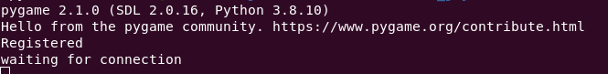
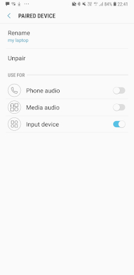

USB Bluetooth bridge for Joystick and RC radio
==

This repo contains two projects;

1. USB Joystick to Bluetooth bridge - for using a USB joystick on, for example, an Android device to play the excellent [Picasim RC flight simulator](https://play.google.com/store/apps/details?id=com.rowlhouse.picasim&hl=en_ZA&gl=US)
2. IBUS to USB bridge aka Flysky FS-ia6b receiver IBUS to USB joystick converter - for connecting a Flysky RC transmitter to a laptop to practice RC flying using a simulator.  The Flysky radio has an USB cable, but lots more phun without the wire (e.g. sitting on my couch)

Both projects works independantly, but may be used together to play Picasim on an Android phone using a Flysky radio

Credits
===
The joystick-bt bridge (1) is a remix of [EmuBTHID](https://github.com/Alkaid-Benetnash/EmuBTHID) (copied BluetoothHID.py) and [Bluetooth GPIO Joystick for Raspberry Pi](https://github.com/Heerkog/HIDpi) (sdp_record_joystick_4axis.xml).  The HID descriptor file was only modified to allow 4 axis instead of the 2 in the source.

The IBUS-USB bridge (2) uses [circuitpython-ibus](https://github.com/house4hack/circuitpython-ibus) and example code from Adafruit's [Custom HID Devices in CircuitPython](https://learn.adafruit.com/custom-hid-devices-in-circuitpython/report-descriptors)

USB Joystick to BT bridge
==

Below is based on

```
Ubuntu 20.04
python 3.8
```

Installation
===

Create a virtualenv 
**(note for conda users, the version of python in Anaconda repo's is not compiled with the bluetooth extensions for socket and does not work (ymmv) using conda, so sticking to raw virtualenv for now)**

``` 
python3 -m venv python-env
```

Activate the virtualenv

```
source python-env/bin/activate
```

Install pygame and dbus-python
```
pip install pygame
pip install dbus-python


```

Update Bluetooth service
==
on Ubuntu 20.04, the bluetooth.service needed to be modified to include the **input** module:

Edit bluetooth.service 

```
sudo nano /usr/lib/systemd/system/bluetooth.service
```

and update the ExecStart line in the [service] section to read:

```
...

[Service]
Type=dbus
BusName=org.bluez
ExecStart=/usr/lib/bluetooth/bluetoothd -P input

...

```

Once edited and saved, reload the service file, restart the service and check the status:

```
sudo systemctl daemon-reload
sudo systemctl restart bluetooth.service
sudo systemctl status bluetooth.service
```

Running
===

Run within the activated virtualenv as sudo (in order to access dbus)

```
sudo `which python` joystick_bt_bridge.py
```

If all went well, you should see something like:


Errors
===

If you see "Address already in use" - verify that the bluetooth service was updated correctly and restarted and is running 

If you get "AttributeError: module 'socket' has no attribute 'AF_BLUETOOTH'", it means the bluetooth extension to socket was not compiled into the version of python being used - notably 'Anaconda' has this problem. Check which python is being used ( ``which python`` or try /usr/bin/python directly to verify) and make sure socket.AF_BLUETOOTH is available.  

One way to check is to run these commands in python:

```python
>> import socket
>> print(socket.AF_BLUETOOTH)
AddressFamily.AF_BLUETOOTH
```

As a last resort, you may need to recompile python from source and include the bluetooth extension.

Using
===
Pair your Android phone to your laptop's bluetooth and once paired, make sure the 'Input Device' service is active in the settings in Android (screenshot of Android 8 on Samsung device):



Once the Android device is connected, the console will show the connection details.

Now fire up PicaSim, enable the joystick and map the inputs as needed.


Installation - IBUS to USB bridge
===

The IBUS to USB bridge uses [CircuitPython](https://circuitpython.org/) and was tested using the Trinket M0 device running CircuitPython 7.0.  

To connect to the FS-IA6B IBUS, use the instructions [here](https://github.com/house4hack/circuitpython-ibus)

Into lib folder on the Trinket, add

* ibus.mpy (cross-compiled)
* adafruit_bus_device (from CircuitPython library bundle)
* adafruit_hid (from CircuitPython library bundle)

Copy the source files from the circuitpython folder onto the device.

The contents of boot.py  was used directly from [Custom HID Devices in CircuitPython](https://learn.adafruit.com/custom-hid-devices-in-circuitpython/report-descriptors)

hid_gamepad.py from the examples shipped with the CircuitPython library bundle

Testing
===
Once all wired up and ready to use, test using:

```
jstest --normal /dev/input/js0
```


